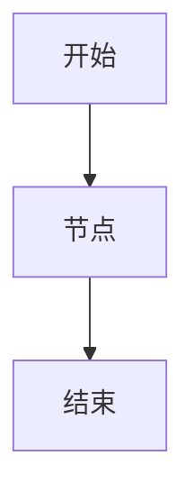

# IT治理知识库建设方案（基线版）

> 版本：v0.2  
> 定位：以操作风险管理矩阵和配套流程图为基础，建设可由 AI 动态维护、支持问答、影响分析和流程绘图的 IT 治理知识库。  
> 边界：本知识库专注于 IT 治理确定性知识，覆盖流程、制度、风险、控制、证据、系统、岗位、表单及治理活动，不纳入项目评审经验库内容。

---

## 1. 建设目标

IT治理知识库用于沉淀信息服务管理相关的确定性知识，重点回答以下问题：

1. 某项 IT 管理流程如何执行；
2. 某个流程涉及哪些部门、岗位、系统、表单和审批节点；
3. 某个流程对应哪些操作风险、控制点和控制证据；
4. 某项制度条款约束哪些流程和控制点；
5. 流程变更会影响哪些风险、控制、证据、制度和上下游流程；
6. AI 能否基于结构化知识自动生成或更新 Mermaid 流程图、操作手册和问答材料。

本知识库不以“上传文件后问答”为目标，而以“治理对象结构化、关系可追溯、内容可维护”为目标。

---

## 2. 总体设计思路

采用“三层底座 + 对象建模 + Agent 编排”的方式建设。

```text
第一层：流程图 Process
说明流程怎么走、谁参与、节点顺序是什么。

第二层：风险控制矩阵 Risk & Control
说明风险是什么、控制点是什么、证据是什么、责任是谁。

第三层：制度文件 Policy
说明依据是什么、约束是什么、审批规则是什么。
```

其中，风险控制矩阵作为主数据，流程图作为展示层，制度文件作为依据层。

```text
风险控制矩阵
  ↓
结构化治理对象
  ↓
生成流程文档 / Mermaid图 / 问答对 / 影响关系
  ↓
入库到语析知识库
  ↓
由 Agent 调用、比对、维护、问答、画图
```

---

## 3. 知识库边界

### 3.1 知识库定位

IT治理知识库定位为确定性知识库，聚焦“流程如何执行、制度如何约束、风险如何控制、证据如何留存”。

### 3.2 纳入范围

主要纳入：

```text
流程
制度
风险
控制
岗位
部门
系统
表单
控制证据
OA流程
操作手册
治理活动
```

主要回答：

```text
怎么办
谁负责
依据什么
经过哪些节点
有哪些风险
有哪些控制点
需要留存什么证据
变更会影响哪些对象
```

### 3.3 不纳入范围

本库不纳入以下内容：

```text
项目评审经验
领导历史关注点
可行性分析会评审话术
采购论证会评审意见
项目立项报告写作经验
项目价值判断经验
量化指标设置经验库
```

如后续需要建设上述内容，应另行建立独立知识库，不与 IT治理知识库混放。

---

## 4. 知识库目录结构

建议在语析和 GitHub 中保持一致的目录结构。

```text
IT治理知识库/
├── 00_总入口/
├── 01_基础资料/
├── 02_治理域/
├── 03_治理对象/
├── 04_流程文档/
├── 05_流程图_Mermaid/
├── 06_问答知识/
├── 07_Agent配置/
├── 08_入库规范/
├── 09_变更管理/
└── 99_归档/
```

GitHub仓库建议结构：

```text
IT-governance-kb/
├── README.md
├── docs/
│   ├── 00_建设方案/
│   ├── 01_基础资料说明/
│   ├── 02_治理域/
│   ├── 03_流程文档/
│   ├── 04_流程图_Mermaid/
│   ├── 05_风险控制/
│   ├── 06_制度映射/
│   ├── 07_问答知识/
│   └── 08_入库规范/
├── objects/
│   ├── processes/
│   ├── risks/
│   ├── controls/
│   ├── policies/
│   ├── systems/
│   ├── roles/
│   └── evidence/
├── agents/
├── scripts/
├── templates/
└── changelog/
```

---

## 5. 需要的基础文件

| 类别 | 文件 | 用途 | 优先级 |
|---|---|---|---|
| 风险控制 | 操作风险管理矩阵_信息服务管理 | 主数据底座，抽取流程、风险、控制、证据、制度关系 | P0 |
| 流程图 | 流程图_信息服务管理 | 抽取流程顺序、泳道角色、节点关系，用于生成 Mermaid | P0 |
| 制度 | 信息系统建设项目管理办法 | 解释项目管理流程依据 | P0 |
| 制度 | IT应用软件需求管理细则 | 解释需求流程依据 | P0 |
| 制度 | 信息服务授权细则 | 解释审批权限和OA流程依据 | P0 |
| 表单 | OA流程清单、表单模板 | 识别流程输入输出和审批证据 | P1 |
| 系统 | 信息系统清单、需求管理系统/OA/问题管理系统说明 | 识别流程支撑系统 | P1 |
| 岗位 | 信息服务部岗位职责 | 识别流程责任人和执行岗位 | P1 |

---

## 6. 治理对象模型

核心实体：

```text
治理域、流程、流程节点、风险、控制、制度、制度条款、表单、系统、岗位、部门、证据、治理活动
```

关系模型：

```text
治理域 包含 流程
流程 包含 流程节点
流程节点 存在 风险
风险 由 控制 缓释
控制 产生 证据
控制 依据 制度条款
流程节点 由 岗位 执行
流程节点 由 部门 负责
流程节点 使用 系统
流程节点 产生 表单
流程 上接 上游流程
流程 下接 下游流程
治理活动 介入 流程节点
```

对象编码规则：

```text
治理域编码：DOM-XX
流程编码：PROC-XX-XX
节点编码：NODE-XX-XX-XX
风险编码：RISK-XX-XX-XX
控制编码：CTRL-XX-XX-XX
制度编码：POL-XX
表单编码：FORM-XX
系统编码：SYS-XX
岗位编码：ROLE-XX
治理活动编码：GOVACT-XX
```

---

## 7. 知识提取方法

### 7.1 从风险控制矩阵提取

抽取字段：一级流程、二级流程、三级流程、三级流程描述、风险点、控制点、主责部门、执行岗位、配合部门、控制频率、控制方式、系统名称、控制证据、内部制度、外部监管制度。

形成四类知识：流程知识、风险知识、控制知识、制度引用知识。

### 7.2 从流程图提取

抽取字段：治理域、泳道角色、流程阶段、流程节点、节点顺序、判断条件、系统标识、上下游流程引用、开始/结束节点。

流程图不作为唯一依据。若流程图与风险矩阵不一致，以风险矩阵为主，流程图作为待核对事项。

### 7.3 从制度文件提取

抽取字段：制度名称、条款编号、条款内容、适用流程、审批权限、责任部门、管理要求、留痕要求、例外情形。

### 7.4 从OA流程和表单提取

抽取字段：流程名称、流程发起人、审批节点、审批角色、审批条件、表单字段、附件要求、输出结果。

---

## 8. 结构化模板

### 8.1 流程文档模板

```markdown
# PROC-XX-XX 流程名称

## 1. 基本信息

- 治理域：
- 流程编号：
- 流程名称：
- 流程 owner：
- 适用范围：
- 上游流程：
- 下游流程：
- 支撑系统：
- 关联制度：

## 2. 流程说明

## 3. 流程节点

| 序号 | 节点名称 | 责任部门 | 执行岗位 | 输入 | 动作 | 输出 | 系统 | 控制证据 |
|---|---|---|---|---|---|---|---|---|

## 4. 风险与控制

| 风险编号 | 风险描述 | 控制编号 | 控制措施 | 控制频率 | 控制方式 | 控制证据 |
|---|---|---|---|---|---|---|

## 5. 制度依据

| 制度名称 | 条款 | 约束内容 | 对应节点 |
|---|---|---|---|

## 6. Mermaid流程图



## 7. 常见问答

## 8. 变更记录
```

### 8.2 风险对象模板

```yaml
id: RISK-XX-XX-XX
name: 风险名称
risk_description: 风险描述
related_domain: 治理域
related_process: 流程
related_node: 流程节点
impact: 影响
control_list:
  - CTRL-XX-XX-XX
source_file: 操作风险管理矩阵
status: active
```

### 8.3 控制对象模板

```yaml
id: CTRL-XX-XX-XX
name: 控制名称
control_description: 控制描述
control_type: 人工控制/系统控制/人工+系统控制
frequency: 按需/每日/月度/季度/年度
owner_department: 主责部门
executor_role: 执行岗位
evidence:
  - 控制证据
related_policy:
  - 制度名称
related_risk:
  - RISK-XX-XX-XX
status: active
```

---

## 9. 入库流程

```text
收集基础文件
  ↓
文件归档与命名
  ↓
字段抽取
  ↓
结构化转换
  ↓
人工核对
  ↓
生成 Markdown 文档
  ↓
生成 Mermaid 流程图
  ↓
生成问答对
  ↓
语析知识库入库
  ↓
向量检索测试
  ↓
Agent 调用测试
  ↓
发布基线版本
```

入库批次：

1. 操作风险管理矩阵 + 配套流程图；
2. 项目管理办法 + 需求管理细则 + 信息服务授权细则；
3. OA流程 + 表单模板 + 系统清单 + 岗位职责；
4. 操作手册 + 审计整改 + 项目台账 + 后评估材料。

---

## 10. 语析知识库配置建议

建议只建设一个主知识库：

```text
KB-IT-GOVERNANCE：IT治理知识库
```

IT治理知识库内部可按治理域、对象类型和来源类型设置标签，不建议拆成过多小库。

切片单位不宜按固定字数，而应按治理对象切片：

```text
一个流程 = 一个主文档
一个风险 = 一个对象片段
一个控制 = 一个对象片段
一个制度条款 = 一个对象片段
一个问答 = 一个对象片段
```

元数据建议：

```yaml
knowledge_base: IT治理知识库
domain: 系统需求管理
object_type: 流程
object_id: PROC-03-01
source_type: 风险控制矩阵/流程图/制度/OA/表单
source_file: 文件名称
version: v0.2
status: active
owner: 信息服务部
last_updated: YYYY-MM-DD
```

---

## 11. Agent工作方式

### 11.1 IT治理路由Agent

判断用户问题对应的治理对象和知识来源：

```text
涉及流程步骤 → 检索流程文档、流程图、流程节点对象
涉及风险控制 → 检索风险对象、控制对象、控制证据
涉及制度依据 → 检索制度条款和制度映射
涉及系统或表单 → 检索系统对象、表单对象、OA流程
涉及流程变更 → 调用影响分析Agent
涉及画图 → 调用画图Agent
```

### 11.2 IT治理问答Agent

职责：回答确定性问题。

输出格式：结论、依据流程、涉及角色、需要材料、风险控制点、制度依据、待确认事项。

### 11.3 流程维护Agent

职责：根据变更要求更新流程文档。

工作步骤：识别变更对象、查找相关流程/风险/控制/制度/表单、判断影响范围、输出修改建议、标记待人工确认事项、经确认后更新 Markdown 和 Mermaid、生成变更日志。

禁止事项：不得自行删除控制点、不得自行降低审批层级、不得自行修改制度依据、不得自行认定流程废止。

### 11.4 影响分析Agent

职责：分析某一变更对流程体系的影响，输出影响流程、影响对象、待确认事项。

### 11.5 画图Agent

职责：根据结构化流程生成 Mermaid 图。

输出要求：优先使用 flowchart TD；复杂流程可按子流程拆分；每个判断节点必须有明确条件；节点名称不得过长；图中保留部门/岗位信息；输出 Mermaid 代码和简要说明。

### 11.6 入库质检Agent

职责：检查知识入库质量。

检查项：是否有流程编号、来源文件、责任部门、风险控制点、控制证据、制度依据；是否存在未闭合流程、孤立风险或孤立控制、流程图与矩阵不一致。

---

## 12. 典型使用场景

1. 流程问答：需求上线流程怎么走？
2. 风险控制查询：需求评审环节有哪些风险控制点？
3. 制度依据查询：需求变更审批依据哪项制度？
4. 流程变更影响分析：如果项目验收前增加后评估指标确认，会影响哪些流程？
5. 自动画图：画一下信息系统建设项目立项到验收的流程。
6. 控制证据查询：系统权限调整需要留存哪些证据？
7. 跨对象追溯：某个控制点涉及哪些流程、岗位、制度和表单？

---

## 13. 质量控制规则

一致性规则：

```text
流程图节点必须能追溯到流程文档或矩阵字段。
控制点必须能追溯到风险控制矩阵。
制度依据必须能追溯到制度名称和条款。
表单字段必须能追溯到OA流程或表单模板。
```

变更规则：

```text
任何流程变更必须生成变更日志。
任何控制点变更必须标记是否影响内控矩阵。
任何审批节点变更必须标记是否影响授权细则。
任何制度依据变更必须标记是否需要制度修订。
```

必须人工确认事项：新增或删除控制点、调整审批层级、调整主责部门、改变制度依据、改变风险评级、流程废止、表单字段删除、系统替换。

---

## 14. 实施计划

### 阶段一：基线建设

目标：用风险控制矩阵和流程图形成第一版 IT治理知识库。

任务：整理基础文件、建立目录结构、抽取治理域/流程/风险/控制/证据、生成核心流程 Markdown、生成 Mermaid 流程图、建立对象编码、入库语析、完成问答测试。

交付物：IT治理知识库目录、治理对象模型、核心流程文档、Mermaid流程图、风险控制对象表、Agent提示词配置、入库质检清单。

### 阶段二：制度补齐

目标：补齐制度条款和流程控制之间的关系。

### 阶段三：执行层补齐

目标：将OA流程、表单、系统和岗位接入知识库。

### 阶段四：Agent能力完善

目标：完善流程问答、风险控制查询、制度追溯、流程变更影响分析、Mermaid画图、入库质检等能力。

---

## 15. 基线版本范围

v0.2 基线版本先覆盖以下治理域：

```text
01 信息化管理
02 信息系统建设项目管理
03 系统需求管理
04 系统开发与测试
05 系统运行与维护
06 基础设施管理
07 信息安全管理
08 信息科技外包管理
```

v0.2 不处理以下内容：

```text
不纳入项目评审经验库内容
不替换正式制度文件
不自动修改OA流程
不自动认定风险评级调整
不自动作为审计定责依据
```

---

## 16. 后续待确认事项

1. 语析是否支持对文档设置结构化元数据标签；
2. 是否需要把风险控制矩阵拆成对象级 JSON/YAML；
3. 是否需要将 Mermaid 图作为独立文档入库；
4. OA流程是否可导出节点和表单字段；
5. 制度文件是否有正式版本号和条款编号；
6. 是否需要建立人工审批后的知识库发布流程。
